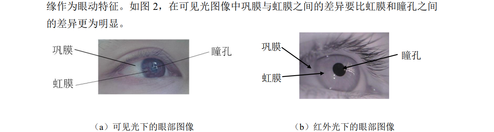

# Eye Movement Reference



[Here](./models/) are models prepared for you to complete landmark prediction.

[Here](./Code/) are Codes written for you as references with regard to `how to use opencv` and `how to use model prepared for you`

## Simply run

```shell script
python Code/blink_detection.py 
```

You can rewrite the function or parameters as you wish, and you are welcomed to create pull requests or fork and merge for this repo.