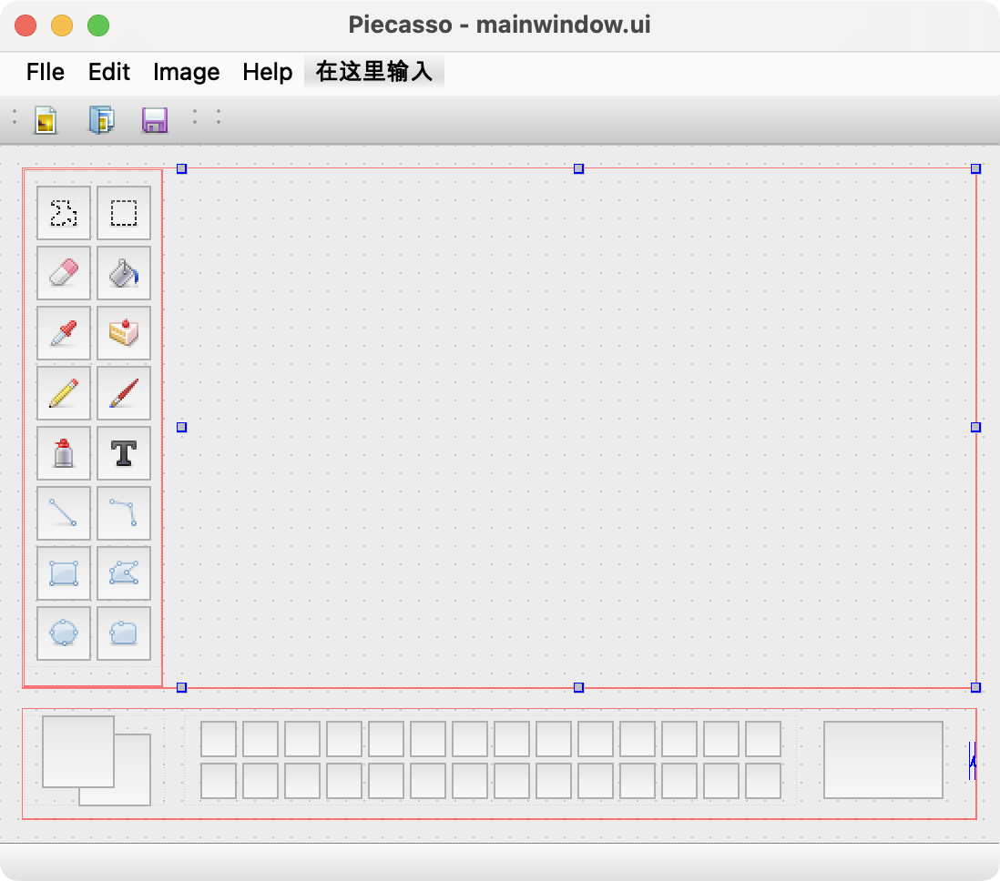
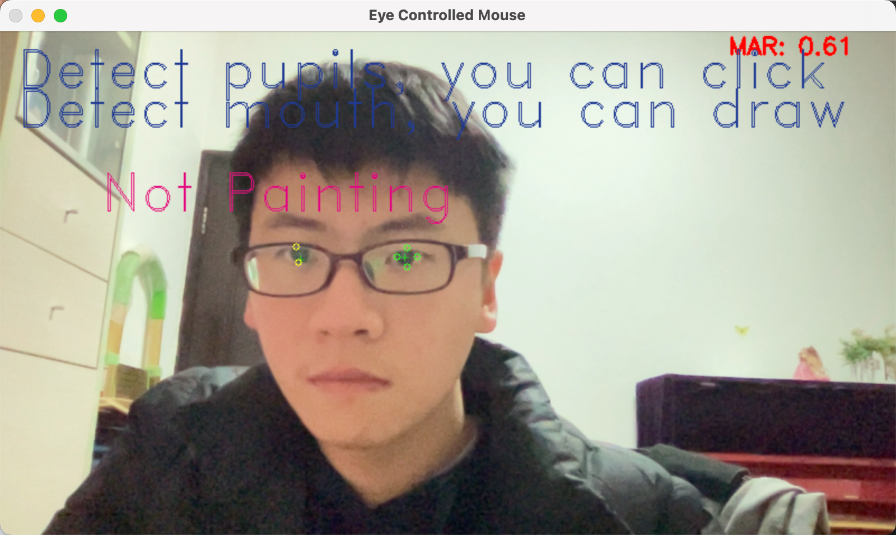
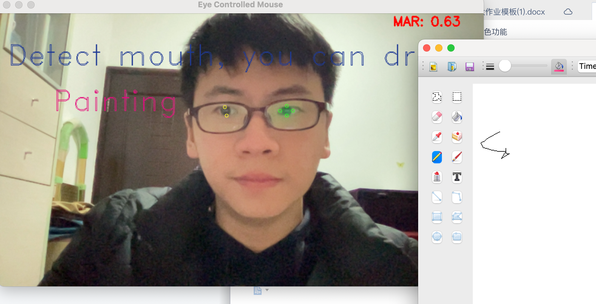

# 眼动画图

目前对于眼动的研究主要依赖于双目眼动仪，即一个对准瞳孔的红外相机用于计算视线向量，和一个场景相机用于估计视线在场景中的观测点，这对于居家实验环境并不友好。

因此，我们采取了基于facial landmarks和eyes keypoints的单目视线估计策略，借助预训练模型对眼部与瞳孔点位进行跟踪后，将坐标关于屏幕成比例放大，实现单目视线估计。

此外，我们制作了基于PyQT的画图程序，它是通过QT Designer进行设计后人为添加图标等元素的绘图UI程序



我们基于单目视线估计实现了眼动操控鼠标移动和单击选择画图工具；同时为了避免眼动控制功能过于复杂，我们引入了对嘴部keypoints的检测与计算，实现嘴部开闭控制开始绘图/停止绘图。

效果展示如下

运行

```shell script
python demo.py
```



再打开绘图窗口

```shell script
python paint.py
```

通过眨眼控制鼠标点击


通过张嘴控制画笔落笔/抬笔

