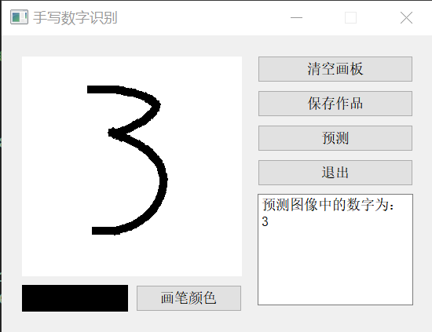

# Group 4

>基于QT和深度学习实现手写数字识别的人机交互智能系统
>
>王殿仪，王正宝，胡南，焦元鸿，袁煜恒
>
>2020303349，2020302781，2020302607，2020302876，2020303356

### 环境要求

- 编程语言：python
- IDE：vscode，PyCharm
- 深度学习框架：tensorflow.keras
- 工具包：Windows，python==3.x，tensorflow-cpu==2.7.0，PyQt5==5.x，numpy，pandas，opencv-python，（Windows or Linux）

### 文件功能

train.py：网络结构搭建+数据预处理+模型训练+模型验证测试

shibie.py: 用户界面布局+画笔、鼠标交互板块+按钮接口处理逻辑

用户在配置完环境后，直接运行shibie.py即可，实现全部功能

### 界面展示

